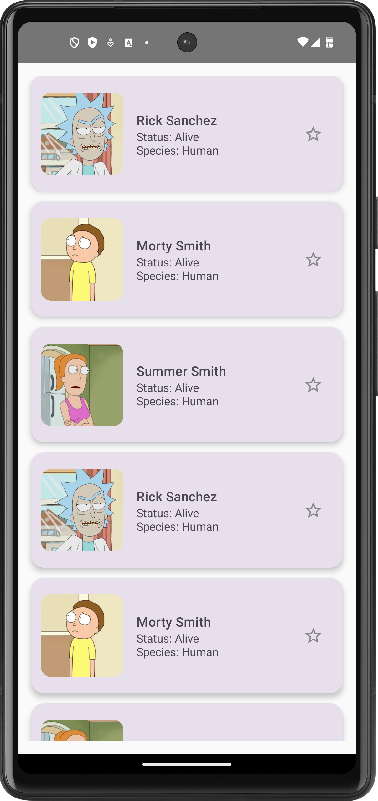

# ⭐ Personagem Favorito - Projeto de Aula (Jetpack Compose + Kotlin)

Este projeto é uma base para prática em sala de aula, com foco em Android Nativo utilizando Kotlin e Jetpack Compose. O app simula uma lista de personagens e permite marcar favoritos com uma estrela. A partir dessa base, os alunos devem integrar com uma API real e salvar os favoritos com SharedPreferences.

---

## 🎯 Objetivos

- Usar **Retrofit** para buscar dados reais de personagens de uma API pública.
- Exibir os personagens usando **Jetpack Compose** com `LazyColumn` e `Card`.
- Utilizar **SharedPreferences** para salvar favoritos localmente.
- Aplicar **Navigation Compose** para navegar para uma tela de detalhes.
- Utilizar **Coil** para carregar imagens da internet.
- Refatorar a classe `CharacterMock` para usar os dados reais da API.

---

## 📚 Tecnologias usadas

- Kotlin
- Jetpack Compose
- Coil (para carregar imagens)
- SharedPreferences (para favoritos)
- Navigation Compose
- Retrofit (a ser implementado)
- Coroutines

---

## ✅ O que já está pronto

- Layout básico da tela principal com uma lista de personagens (mock).
- Estilo visual com cards, imagem, texto e botão de favorito.
- Botão de estrela simulando comportamento de favoritar.
- Estrutura preparada para Retrofit, ViewModel e navegação.

---

## 🖼️ Exemplo de execução

Veja abaixo uma prévia do app em execução:

---

## 📌 O que você precisa fazer

1. **Escolher uma API pública** (ex: Rick and Morty, Pokémon, Star Wars, Marvel...).
2. **Integrar o Retrofit** para buscar os dados reais da API.
3. **Substituir a lista `CharacterMock` pelos dados reais**.
4. **Implementar a lógica de favoritos com SharedPreferences**:
   - Salvar o ID ou nome do personagem favorito.
   - Restaurar favoritos ao abrir o app.
5. (Opcional) Criar uma nova tela com **detalhes do personagem** ao clicar no card.
6. (Opcional) Salvar o personagem favorito em um banco de dados com **Room**.

---

## 🧠 Dicas

- Use o `remember` apenas para controle temporário na tela. Favoritos reais devem ser persistidos com SharedPreferences.
- Use o ViewModel para isolar a lógica de UI.
- Reaproveite a estrutura já criada no projeto.
- Teste a navegação com dados via `navController.navigate("detalhes/${personagem.id}")`.

---

## 🔗 APIs públicas sugeridas

- [Rick and Morty API](https://rickandmortyapi.com/)
- [PokéAPI](https://pokeapi.co/)
- [Star Wars API (SWAPI)](https://swapi.dev/)
- [Marvel Developer Portal](https://developer.marvel.com/) (exige chave)
- [Studio Ghibli API](https://ghibliapi.vercel.app/)

---

## 🔥 Desafio (para quem quer ir além)

Se você já concluiu os requisitos principais e quer explorar mais recursos do Android Nativo, aqui vão alguns desafios extras:

### 📁 1. Permissões em tempo real + manipulação de arquivos
- Solicite permissão de escrita com `ActivityResultContracts.RequestPermission`.
- Salve os dados do personagem (nome, status, espécie, etc.) em um arquivo `.txt` na memória do dispositivo.
- Crie um botão "Exportar" no card ou na tela de detalhes para realizar essa ação.

### 📤 2. Intents: Compartilhamento de personagem
- Implemente um botão de "Compartilhar" para enviar a **imagem do personagem + suas informações** para outros apps (ex: WhatsApp, Gmail, Telegram).
- Use um `ShareCompat.IntentBuilder` ou `Intent.ACTION_SEND` com `type = "image/*"` e texto descritivo.

---

## 🚀 Boa prática!

Este é um exercício prático com liberdade criativa. Sinta-se livre para personalizar a UI, mudar o tema, aplicar animações, entre outros. Capriche e aproveite para revisar os conceitos aprendidos! 😉

---
